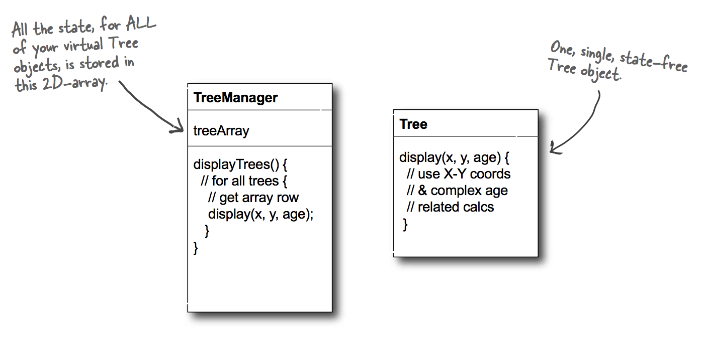

# Design Patterns 设计模式

[Head First Design Patterns Website](http://www.headfirstlabs.com/books/hfdp/)

All the codes in this note comes from [bethrobson/Head-First-Design-Patterns](https://github.com/bethrobson/Head-First-Design-Patterns).

## Creational Patterns 创建模式

### Simple Factory

(Not a design pattern)


```java
public class SimplePizzaFactory {

	public Pizza createPizza(String type) {
		Pizza pizza = null;

		if (type.equals("cheese")) {
			pizza = new CheesePizza();
		} else if (type.equals("pepperoni")) {
			pizza = new PepperoniPizza();
		} else if (type.equals("clam")) {
			pizza = new ClamPizza();
		} else if (type.equals("veggie")) {
			pizza = new VeggiePizza();
		}
		return pizza;
	}
}
```

### Factory Method

The Factory Method Pattern **defines an interface for creating an object, but lets subclasses decide which class to instantiate**. Factory Method lets a class defer instantiation to subclasses.


```java
public abstract class PizzaStore {

	abstract Pizza createPizza(String item);

	public Pizza orderPizza(String type) {
		Pizza pizza = createPizza(type);
		System.out.println("--- Making a " + pizza.getName() + " ---");
		pizza.prepare();
		pizza.bake();
		pizza.cut();
		pizza.box();
		return pizza;
	}
}
```

```java
public class NYPizzaStore extends PizzaStore {

	Pizza createPizza(String item) {
		if (item.equals("cheese")) {
			return new NYStyleCheesePizza();
		} else if (item.equals("veggie")) {
			return new NYStyleVeggiePizza();
		} else if (item.equals("clam")) {
			return new NYStyleClamPizza();
		} else if (item.equals("pepperoni")) {
			return new NYStylePepperoniPizza();
		} else return null;
	}
}
```

```java
public class NYStyleCheesePizza extends Pizza {

	public NYStyleCheesePizza() {
		name = "NY Style Sauce and Cheese Pizza";
		dough = "Thin Crust Dough";
		sauce = "Marinara Sauce";

		toppings.add("Grated Reggiano Cheese");
	}
}
```

### Abstract Factory

The Abstract Factory Pattern **provides an interface for creating families of related or dependent objects without specifying their concrete classes**.


```java
public interface PizzaIngredientFactory {

	public Dough createDough();
	public Sauce createSauce();
	public Cheese createCheese();
	public Veggies[] createVeggies();
	public Pepperoni createPepperoni();
	public Clams createClam();

}
```

```java
public class NYPizzaStore extends PizzaStore {

	protected Pizza createPizza(String item) {
		Pizza pizza = null;
		PizzaIngredientFactory ingredientFactory =
			new NYPizzaIngredientFactory();

		if (item.equals("cheese")) {

			pizza = new CheesePizza(ingredientFactory);
			pizza.setName("New York Style Cheese Pizza");

		} else if (item.equals("veggie")) {

			pizza = new VeggiePizza(ingredientFactory);
			pizza.setName("New York Style Veggie Pizza");

		} else if (item.equals("clam")) {

			pizza = new ClamPizza(ingredientFactory);
			pizza.setName("New York Style Clam Pizza");

		} else if (item.equals("pepperoni")) {

			pizza = new PepperoniPizza(ingredientFactory);
			pizza.setName("New York Style Pepperoni Pizza");

		}
		return pizza;
	}
}
```

```java
public class CheesePizza extends Pizza {
	PizzaIngredientFactory ingredientFactory;

	public CheesePizza(PizzaIngredientFactory ingredientFactory) {
		this.ingredientFactory = ingredientFactory;
	}

	void prepare() {
		System.out.println("Preparing " + name);
		dough = ingredientFactory.createDough();
		sauce = ingredientFactory.createSauce();
		cheese = ingredientFactory.createCheese();
	}
}
```

1. `PizzaStore nyPizzaStore = new NYPizzaStore();`
2. `nyPizzaStore.orderPizza(“cheese”);`
3. `Pizza pizza = createPizza(“cheese”);`
4. `Pizza pizza = new CheesePizza(nyIngredientFactory);`
5. `pizza.prepare();`

### Singleton

The Singleton Pattern ensures **a class has only one instance, and provides a global point of access to it**.


#### Thread-safe singleton

Double-checked locking

```java
public class Singleton {
	private volatile static Singleton uniqueInstance;

	private Singleton() {}

	public static Singleton getInstance() {
		if (uniqueInstance == null) {
			synchronized (Singleton.class) {
				if (uniqueInstance == null) {
					uniqueInstance = new Singleton();
				}
			}
		}
		return uniqueInstance;
	}
}
```

## Structural Patterns 结构模式

### Adapter

The Adapter Pattern **converts the interface of a class into another interface the clients expect**. Adapter lets classes work together that couldn’t otherwise because of incompatible interfaces.

#### Object Adapter


#### Class Adapter

Needs multiple inheritance, impossible in Java.


```java
public class TurkeyAdapter implements Duck {
	Turkey turkey;

	public TurkeyAdapter(Turkey turkey) {
		this.turkey = turkey;
	}

	public void quack() {
		turkey.gobble();
	}

	public void fly() {
		for(int i=0; i < 5; i++) {
			turkey.fly();
		}
	}
}
```

### Facade

The Facade Pattern **provides a unified interface to a set of interfaces in a subsytem**. Facade defines a higher- level interface that makes the subsystem easier to use.


```java
public class HomeTheaterFacade {
	Amplifier amp;
	Tuner tuner;
	DvdPlayer dvd;
	CdPlayer cd;
	Projector projector;
	TheaterLights lights;
	Screen screen;
	PopcornPopper popper;

	public HomeTheaterFacade(Amplifier amp,
				 Tuner tuner,
				 DvdPlayer dvd,
				 CdPlayer cd,
				 Projector projector,
				 Screen screen,
				 TheaterLights lights,
				 PopcornPopper popper) {

		this.amp = amp;
		this.tuner = tuner;
		this.dvd = dvd;
		this.cd = cd;
		this.projector = projector;
		this.screen = screen;
		this.lights = lights;
		this.popper = popper;
	}

	public void watchMovie(String movie) {
		System.out.println("Get ready to watch a movie...");
		popper.on();
		popper.pop();
		lights.dim(10);
		screen.down();
		projector.on();
		projector.wideScreenMode();
		amp.on();
		amp.setDvd(dvd);
		amp.setSurroundSound();
		amp.setVolume(5);
		dvd.on();
		dvd.play(movie);
	}
  ...
}
```

### Bridge

The Bridge Pattern allows you **to vary the implementation and the abstraction** by placing the two in separate class hierarchies.


### Flyweight

A flyweight is **an object that minimizes memory usage by sharing as much data as possible with other similar objects**; it is a way to use objects in large numbers when a simple repeated representation would use an unacceptable amount of memory.



## Behavioral Patterns 行为模式

### Strategy

The Strategy Pattern **defines a family of algorithms, encapsulates each one, and makes them interchangeable**. Strategy lets the algorithm vary independently from clients that use it.


```java
public abstract class Duck {
	FlyBehavior flyBehavior;
	QuackBehavior quackBehavior;

	public Duck() {
	}

	public void setFlyBehavior(FlyBehavior fb) {
		flyBehavior = fb;
	}

	public void setQuackBehavior(QuackBehavior qb) {
		quackBehavior = qb;
	}

	abstract void display();

	public void performFly() {
		flyBehavior.fly();
	}

	public void performQuack() {
		quackBehavior.quack();
	}

	public void swim() {
		System.out.println("All ducks float, even decoys!");
	}
}
```

```java
public interface FlyBehavior {
	public void fly();
}
```

### Observer

The Observer Pattern defines a one-to-many dependency between objects so that **when one object changes state, all of its dependents are notified and updated automatically**.


```java
public interface Subject {
	public void registerObserver(Observer o);
	public void removeObserver(Observer o);
	public void notifyObservers();
}
```

```java
public interface Observer {
	public void update(float temp, float humidity, float pressure);
}
```

### Command

The Command Pattern **encapsulates a request as an object**, thereby letting you parameterize other objects with different requests, queue or log requests, and support undoable (撤销) operations.


## Concurrency Patterns 并发模式

### Double-checked locking

volatile

# Principles & Laws

## Design Principles

Identify the aspects of your application that vary and separate them from what stays the same.
- Encapsulate what varies
- Program to an interface, not to an implementation
- Favor composition over inheritance

## Liskov Substitution Principle

Let $q(x)$ be a property provable about objects x of type T. Then $q(y)$ should be provable for objects y of type S where S is a subtype of T.

派生类（子类）对象能够替换其基类（超类）对象被使用。

- Strategy

## Open-Closed Principle

Classes should be open for extension, but closed for modification.

- Decorator
- Observer

## Dependency Inversion Principle

Depend upon abstractions. Do not depend upon concrete classes.

### Guidelines

- No variable should hold a reference to a concrete class.
- No class should derive from a concrete class.
- No method should override an implemented method of any of its base classes.

### Patterns

- Factory Method
- Abstract Factory

## Single Responsibility

A class should have only one reason to change.

## Interface Segregation Principle

No client should be forced to depend on methods it does not use.

## Principle of Least Knowledge (Law of Demeter)

Talk only to your immediate friends.

Only invoke methods that belong to:

- The object itself
- Objects passed in as a parameter to the method
- Any object the method creates or instantiates
- Any components of the object

**Not to call methods on objects that were returned from calling other methods!!**

> While the principle reduces the dependencies between objects and studies have shown this reduces software maintenance, it is also the case that applying this principle results in more “wrapper” classes being written to handle method calls to other components. This can result in increased complexity and development time as well as decreased runtime performance.

### Patterns

- Decorator

## Composition/Aggregate Reuse Principle

Favor composition over inheritance.

- Strategy


...
