# Unified Modeling Language

## Static Modeling

- Class diagrams (widely used)
- Package diagrams
- Component diagrams
- Composite structure diagrams
- Deployment diagrams

## Behavioral Modeling

- Use case diagrams (widely used)
- Interaction diagrams
- Sequence diagrams (widely used)
- Collaboration diagrams
- State diagrams (widely used)
- Activity diagrams (widely used)

## Use case diagrams

capture the requirements of a system from the user’s perspective

<p align="center">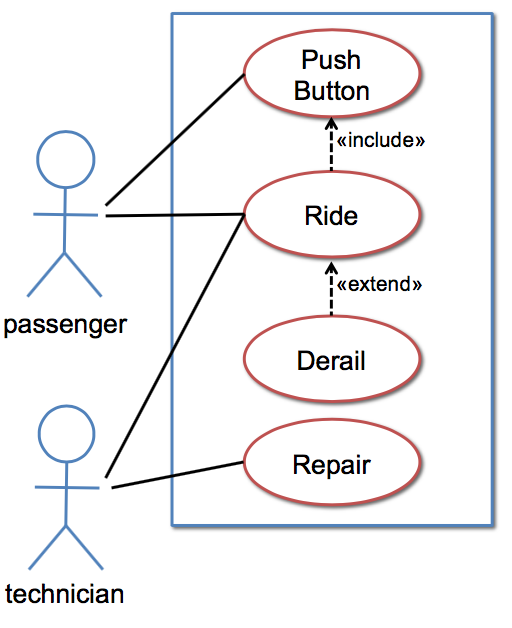</p>

- Inclusion (e.g., push button include in ride)
- Generalization/specialization (e.g., push train button and push station button are specializations of push button)
- Extension expresses an exceptional variation of a use case (e.g., derail is an exceptional ride)

## Statechart Diagrams

Show the various stages of an entity during its lifetime

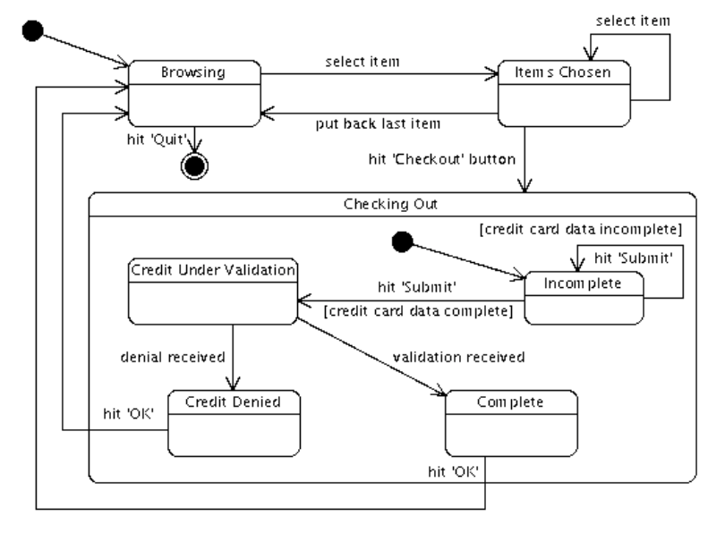

## Class Diagram

Models the static relationships between the components of a system.

- The multiplicity of a class is specified by a number in the upper right
corner of the component
  - Usually omitted and assumed to be more than 1
  - Specifying a multiplicity of 1 indicates the class should be a singleton.


- Visibility
  - Public `+`
  - Private `-`
  - Protected `#`
  - Package `~`
- Parameter list
  - Name
  - Type

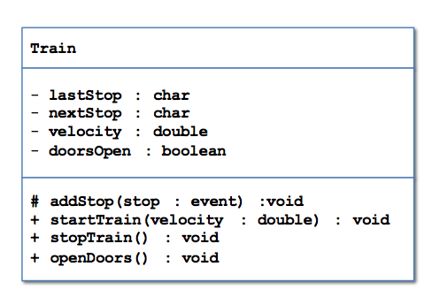

### Dependency

class A uses class B

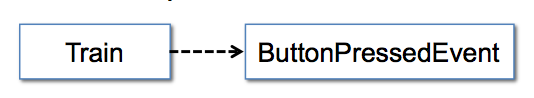

Depicted by a dotted arrow

### Association

class A has a class B

Use number labels to indicate multiplicity

You can also explicitly name the associations

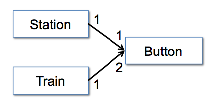

### Aggregation

Class A owns a Class B

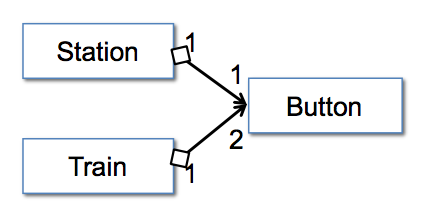

### Composition

Class A is made up of Class B

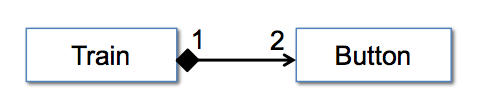

In Java, composition is often indicative of the inner class style relationship.

### Generalization

inheritance (`extend` in Java)

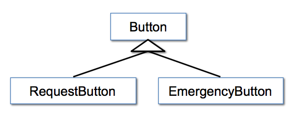

### Realization

subtyping, Class A `implement`s interface B

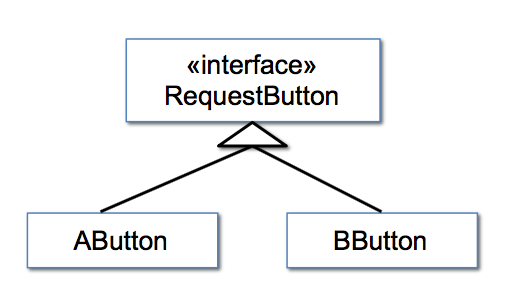

## Interaction Diagrams

Focus on communication between elements

- Sequence diagrams
- Communication diagrams
- Interaction overview diagrams
- Timing diagrams

## Sequence diagrams

show a time-based view of messages between objects

Think of it as a table:
- Columns are classes and/or actors
- Rows are time steps
- Entries show control/data flow (e.g., method invocations, important changes in state)

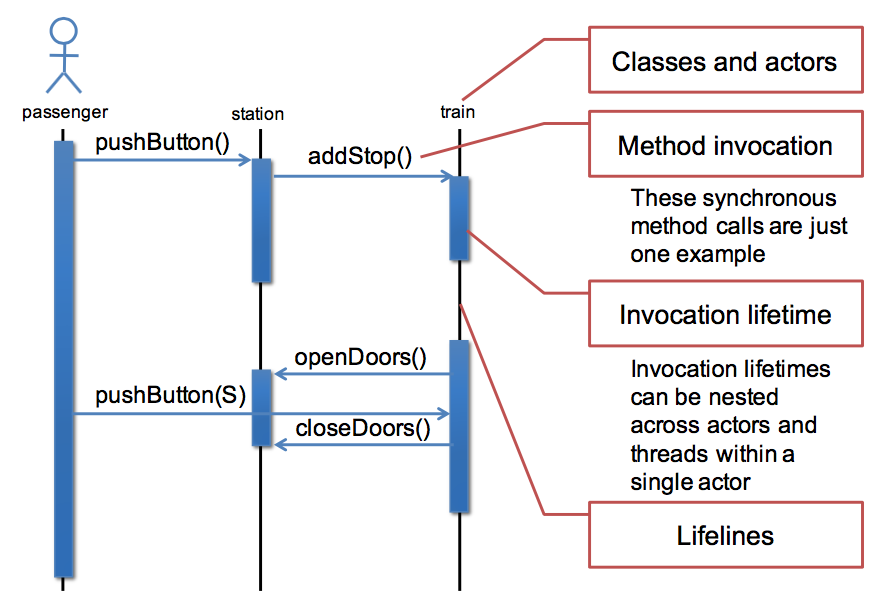

### Loops and Alternatives

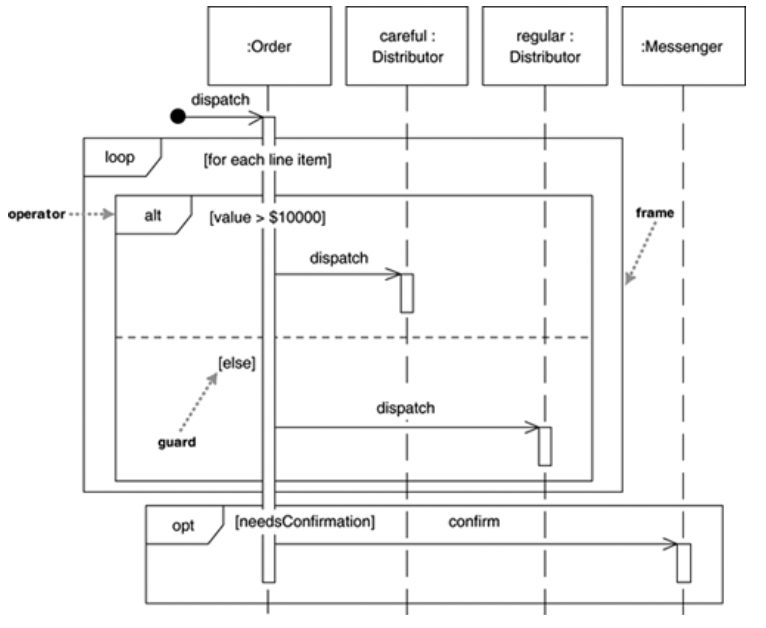

### An Exercise

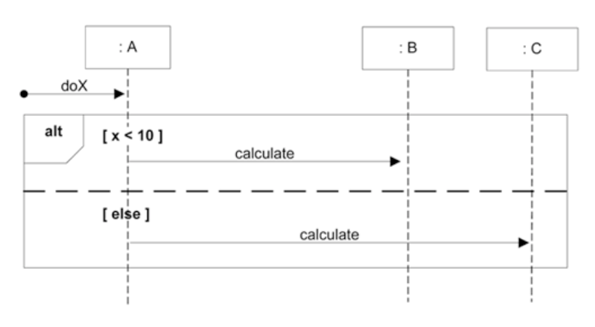

```java
public class A {
  public void doX() {
    if (x < 10) {
      B.calculate();
    } else {
      C.calculate();
    }
  }
}
```

## The Good

- A common language
- Visual syntax is useful (at least to a point)
- To the extent UML is precise, it forces clarity
- Commercial tool support

## The Bad

- It’s a hodge podge of ideas
- Visual syntax does not scale well
- Semantics is not completely clear


...
